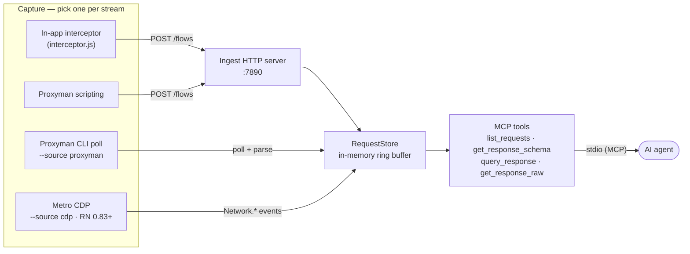

# mobile-network-mcp

Token-efficient network MCP server for mobile apps — gives AI coding agents
visibility into your app's API traffic via **schema-first querying** instead of
dumping whole responses into the context window.

## Why

Pasting a 300 KB JSON response into a chat burns the context window. This server
captures your app's network flows and exposes them through tools that let an AI:
learn a response's **shape** for a few hundred tokens, **query** just the fields
it needs, and fall back to the **raw** body only as a last resort. The shape and
query logic comes from [**json-schema-sketch**](https://www.npmjs.com/package/json-schema-sketch),
a standalone package extracted from this project.

## How it works



The **push** doors (interceptor, Proxyman script) POST into the ingest server; the
**pull** doors (Proxyman CLI, CDP) write to the store directly. Everything funnels
into one in-memory store, and the four tools read from it.

## Install

You don't need to install anything to *use* it — the MCP config below runs it via
`npx mobile-network-mcp` (npx fetches it on demand). For a global command instead:

```bash
npm i -g mobile-network-mcp     # then: mobile-network-mcp --help
```

**Building from source** (contributors): clone the repo, then `npm install` (pulls
the project's dependencies) and `npm run build` (compiles TypeScript → `dist/`).

## Add to your MCP client

Quickest path — let the CLI print the config with the port already set:

```bash
npx mobile-network-mcp --print-mcp-config
```

### Claude Code

Add to your project's `.mcp.json` (or run `claude mcp add`):

```json
{
  "mcpServers": {
    "mobile-network-mcp": {
      "command": "npx",
      "args": ["-y", "mobile-network-mcp", "--ingest-port", "7890", "-i", "tracking|analytics|adtracker"]
    }
  }
}
```

### Codex

Add to `.codex/config.toml`:

```toml
[mcp_servers.mobile-network-mcp]
command = "npx"
args = ["-y", "mobile-network-mcp", "--ingest-port", "7890", "-i", "tracking|analytics|adtracker"]
```

`--ingest-port` sets the port the ingest server (and your interceptors) use; `-i`
is a regex of URLs to ignore. **Restart the client** after adding. For local
development (unpublished), swap `npx -y mobile-network-mcp` for
`node /abs/path/to/dist/bin/cli.js`.

**Persisting a capture source** — any flag in `args` sticks. To always run, say,
Proxyman CLI capture:

```json
"args": ["-y", "mobile-network-mcp", "--source", "proxyman", "-d", "api.example.com", "--ingest-port", "7890"]
```

Or generate that block: `mobile-network-mcp --source proxyman -d api.example.com --print-mcp-config`.

### Choosing the capture source

`--source` (in `args`) picks how flows are captured. The **ingest HTTP server
always runs**, so `--source` adds an *active* source on top. Absent → `ingest`.
Only the `args` array changes between modes (same `"command": "npx"` /
`mobile-network-mcp` wrapper shown above; for Codex put the same array in
`.codex/config.toml`):

**`ingest`** — default; flows pushed by an in-app interceptor or the Proxyman script:

```json
"args": ["-y", "mobile-network-mcp", "--ingest-port", "7890", "-i", "tracking|analytics|adtracker"]
```

**`proxyman`** — server polls `proxyman-cli`; no in-app/script setup, sees native traffic too:

```json
"args": ["-y", "mobile-network-mcp", "--source", "proxyman", "-d", "api.example.com", "--ingest-port", "7890", "-i", "tracking|analytics|adtracker"]
```

**`cdp`** — React Native Metro inspector, **RN 0.83+ only**:

```json
"args": ["-y", "mobile-network-mcp", "--source", "cdp", "--port", "8081", "-i", "tracking|analytics|adtracker"]
```

## Capture methods — pick ONE per traffic stream

The ingest HTTP server (default port **7890**) always runs. Choose how flows
reach it. ⚠️ Don't run two methods that see the same traffic (e.g. Proxyman
scripting **and** `--source proxyman`) — you'll get duplicates.

> **The server is launched by your MCP client** from the `args` in your config —
> you don't run it by hand, and the source is fixed **at launch** (not switchable
> mid-session). To change methods, edit your config `args` and restart the client.
> The only commands you run yourself are the `--print-…` helpers below (they just
> print and exit).

### 1. Proxyman scripting — recommended (captures everything, incl. native)

Generate the script with the ingest port already injected, then paste it into
Proxyman:

```bash
mobile-network-mcp --print-proxyman-script                 # uses port 7890
mobile-network-mcp --print-proxyman-script --ingest-port 7895
```

Then in Proxyman → **Tools → Scripting**: enable the tool, new script (Cmd+N),
set URL to `*`, check both **Request** and **Response**, paste, and save.

### 2. Proxyman CLI capture — no scripting, polls `proxyman-cli`

Set `--source proxyman` (plus `-d <domain>` to scope) in your config `args` — see
[Choosing the capture source](#choosing-the-capture-source). The server then polls
Proxyman's export and writes to the store directly (port-independent). *(For a
quick local test outside the MCP client: `node dist/bin/cli.js --source proxyman
-d api.example.com`.)*

### 3. In-app interceptor — React Native, no proxy needed

Add to your app's dev entry (e.g. `index.js`), as early as possible:

```js
if (__DEV__) require('mobile-network-mcp/interceptor');
```

For a real device, point it at your machine's LAN IP and gate it on a dedicated
build flag (not just `__DEV__`). iOS/Android/Flutter snippets live on the
`feature/platform-interceptors` branch.

> **CDP / React Native Metro** capture (`--source cdp`) requires **RN 0.83+**
> (Hermes' `Network` domain). On older RN, use one of the methods above.

## MCP tools

| Tool | Purpose |
|------|---------|
| `list_requests` | Compact table of captured flows (id, method, status, URL, size, time). Filter by URL/method/status. |
| `get_response_schema` | The **shape** of a JSON response (keys + types, no values). Start here. |
| `query_response` | Extract specific values by path — `data.users[*].id`, multiple paths at once. |
| `get_response_raw` | Full raw body (truncated). Escape hatch; prefer schema + query. |
| `server_status` | Reports the ingest port + captured-flow count — find which port interceptors should POST to. |

Typical flow: `list_requests` → `get_response_schema <id>` → `query_response <id> <path>`.

`get_response_schema` and `query_response` are powered by
[**json-schema-sketch**](https://www.npmjs.com/package/json-schema-sketch) — the
schema-inference and JSON-path library behind the token savings, extracted from this
project and published as a standalone package.

## CLI options

The command is **`mobile-network-mcp`** once installed (`npm i -g mobile-network-mcp`)
or run on demand via **`npx mobile-network-mcp …`**. For local development use
`node dist/bin/cli.js …`. **Every flag below can also go in your MCP client's
`args` array to persist it** (e.g. `--source proxyman`).

**Capture source**

| Flag | Default (env) | Description |
|------|---------------|-------------|
| `--source`, `-s` | `ingest` (`RN_MCP_SOURCE`) | Active capture source: `ingest`, `proxyman`, or `cdp`. The ingest HTTP server always runs regardless. |

**Ingest (all modes)**

| Flag | Default (env) | Description |
|------|---------------|-------------|
| `--ingest-port` | `7890` (`RN_INGEST_PORT`) | Port the ingest HTTP server listens on (interceptors POST here). |
| `--ignore-url`, `-i` | — | Drop captured URLs matching this regex. Repeatable. |

**Proxyman (`--source proxyman`)**

| Flag | Default (env) | Description |
|------|---------------|-------------|
| `--domain`, `-d` | — | Capture only these domains. Repeatable. |
| `--proxyman-cli` | Proxyman.app default (`RN_PROXYMAN_CLI`) | Path to the `proxyman-cli` binary. |
| `--poll-interval` | `2000` (`RN_POLL_INTERVAL`) | How often (ms) to poll `proxyman-cli`. |

**CDP — React Native Metro (`--source cdp`, RN 0.83+)**

| Flag | Default (env) | Description |
|------|---------------|-------------|
| `--port`, `-p` | `8081` (`RN_METRO_PORT`) | Metro bundler port. |
| `--host` | `localhost` (`RN_METRO_HOST`) | Metro bundler host. |

**General & helpers**

| Flag | Default (env) | Description |
|------|---------------|-------------|
| `--max-flows` | `500` (`RN_MCP_MAX_FLOWS`) | Max stored requests (ring-buffer capacity). |
| `--print-proxyman-script` | — | Print the Proxyman scripting interceptor (ingest port injected) and exit. |
| `--print-mcp-config` | — | Print Claude + Codex MCP config — reflecting any `--source` / `-d` / `-i` / `--ingest-port` you pass — and exit. |
| `--help`, `-h` | — | Show help. |

## Known issues & roadmap

See [`PLAN.md`](./PLAN.md) for capture-pipeline findings and planned fixes.

## Contributing

See [`CONTRIBUTING.md`](./CONTRIBUTING.md).

## License

MIT — see [`LICENSE`](./LICENSE).
